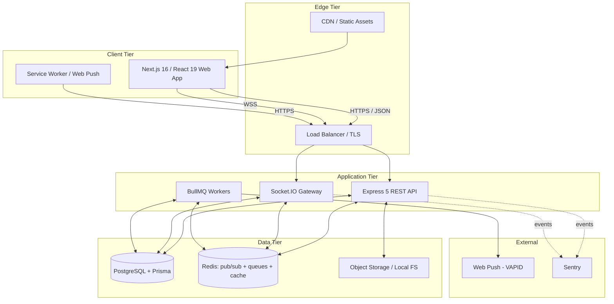
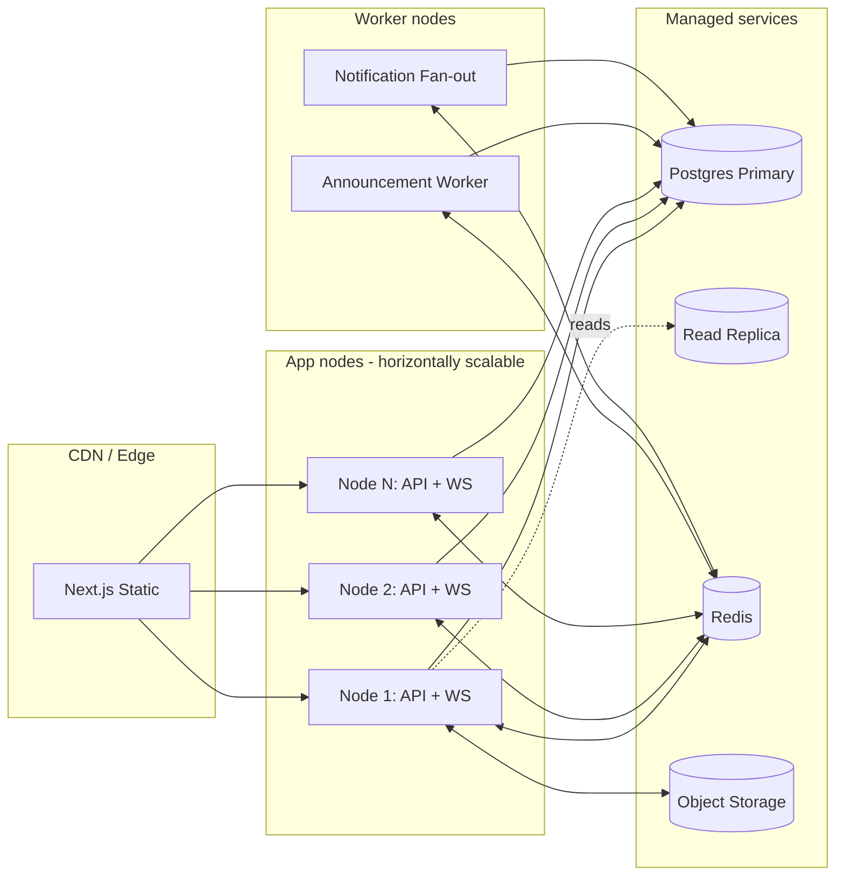
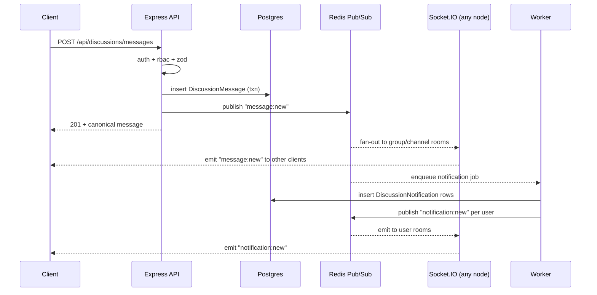
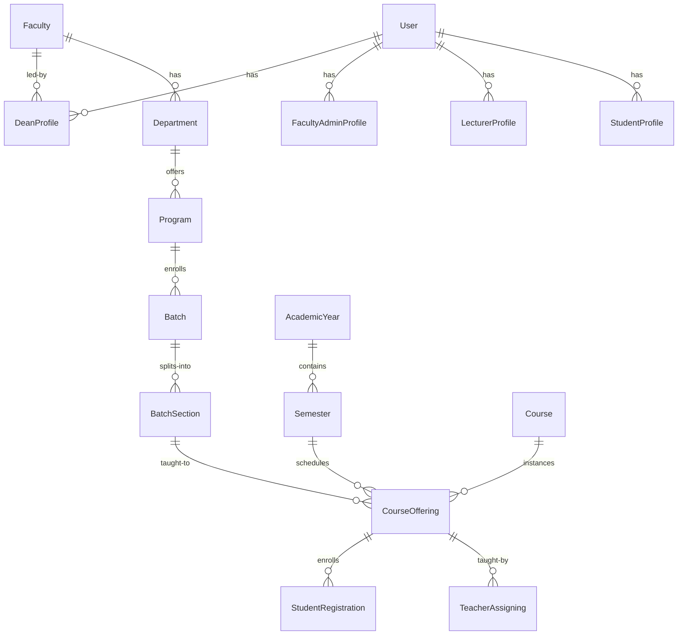

# Campus Connect — System Design

**Project:** Campus Connect — University communication and academic management platform
**Pilot:** Jazeera University, Faculty of Computing (FOCOSIT)
**Status:** Living design document — version 1.0
**Author:** Abdikadir (undergraduate thesis)
**Last updated:** 2026-05-06

---

## 1. Introduction

### 1.1 Purpose
This document defines a single, consistent system design for Campus Connect across architecture, information architecture, and user experience. It is the canonical reference for engineering, the source for thesis Chapter 3 (System Architecture) and Chapter 4 (System Design), and the gate that future module work must align with.

### 1.2 Scope
Eleven domain modules (Auth & RBAC, Announcements, Resources, Assignments, Quizzes, QR Attendance, Discussions, Group DMs, Notifications, Calendar, Role Dashboards), four roles (Super Admin, Faculty Admin / Dean, Lecturer / Teacher / Advisor / TA, Student), one tenant (Jazeera University, FOCOSIT pilot), three locales (English, Somali, Arabic).

### 1.3 Design Principles
1. **One academic hierarchy.** Faculty → Department → Program → Batch → Section → CourseOffering. Every permission, every visibility rule, every dashboard derives from it.
2. **Database is truth, sockets are speed.** Every realtime event has a REST fallback that returns the same shape.
3. **Role-shaped, not feature-shaped.** Each role gets a tailored shell; module pages share the same primitives.
4. **Course as the unit of work.** Most teaching and learning happens inside one course; the course shell is the most-used screen in the product.
5. **Discussion-first, not forum-bolted-on.** Communication is a primary surface, not a tab buried under a course.
6. **Conservative IA, modern interaction.** Familiar mental models from Moodle and traditional LMS; interaction quality on par with Slack and Campuswire.
7. **Locale parity.** EN / SO / AR rendered to the same standard; AR triggers full RTL.
8. **Accessibility as a baseline, not a feature.** WCAG 2.2 AA across all modules.

### 1.4 Audience
Engineering team, thesis supervisor and committee, FOCOSIT stakeholders during pilot review.

---

## 2. Design Influences — Equal Blend Rationale

Five reference systems shape Campus Connect. Each contributes a distinct slice; no single one dominates the whole product.

| Reference | What we take | What we leave |
|---|---|---|
| **Campuswire** | Course-scoped Q&A feed; question vs. note vs. poll post types; instructor-endorsed answers; optional anonymity; per-course feed with category chips | Public marketing surface; cross-institution discovery |
| **Slack** | Workspace → channel → thread mental model; reactions, mentions, presence, typing indicators, read receipts; right-pane thread; quick switcher; deep search | DM-first orientation; freeform workspace creation; huddles |
| **Moodle** | Course shell with sectioned activities; gradebook concept; assignment + quiz + resource as first-class activities; calendar of academic events; enrollment-driven access | Server-rendered legacy UI; PHP block plugin model; XML question bank import as primary path |
| **Trezo (LMS template)** | Admin shell with KPI cards, charts, course tables; calendar widget; clean dense data presentation; consistent card grammar across pages | Generic SaaS aesthetic; demo-data flavor |
| **Jazeera University** | Institutional brand cues (palette anchored on deep navy + accent gold), Somali/Arabic language equality, formal institutional tone | Static prospectus IA |

The blend is asymmetric per surface: discussion screens lean Slack + Campuswire; course screens lean Moodle + Trezo; dean and admin dashboards lean Trezo; brand and tone lean Jazeera. This is intentional — different surfaces have different best-in-class references.

---

## 3. System Architecture

### 3.1 Logical Architecture



### 3.2 Layered View (per service)

```
┌──────────────────────────────────────────────────────────────┐
│  Routes (Express)         — thin, mount validators + auth    │
├──────────────────────────────────────────────────────────────┤
│  Middleware               — auth, csrf, rbac, validate, rate │
├──────────────────────────────────────────────────────────────┤
│  Controllers              — orchestrate, no business logic   │
├──────────────────────────────────────────────────────────────┤
│  Services / Features      — domain logic, transactions       │
├──────────────────────────────────────────────────────────────┤
│  Persistence (Prisma)     — typed DB access                  │
└──────────────────────────────────────────────────────────────┘
```

The same shape applies on the frontend:

```
features/<module>/
├── api/        REST + WS clients (typed)
├── hooks/      data fetching, realtime subscriptions
├── components/ presentational
├── pages/      route-level composition (under app/)
└── schemas/    Zod
```

### 3.3 REST vs WebSocket Boundary

| Concern | Transport | Rationale |
|---|---|---|
| Initial page hydration, paginated history, search | REST | Cacheable, deterministic, paginates well |
| Mutations (create/update/delete) | REST | Single source of write; returns canonical entity |
| Live deltas (new message, reaction added, typing, presence, read receipts) | WebSocket | Push from server; idempotent on client |
| Notifications fan-out | WS + Web Push (offline) | WS for in-app, push for background |
| Long jobs (announcement broadcast, attendance reconciliation) | REST → BullMQ → WS event on completion | Decouples; survives restarts |

**Rule:** every WS event has a REST fallback that returns the same shape. The client treats WS as an optimization layered on REST, not a replacement.

### 3.4 Realtime Channel Conventions

```
user:{userId}                       — direct delivery
group:{discussionGroupId}           — server / class group
group:{groupId}:channel:{channelId} — channel within group
groupdm:{groupDmId}                 — group DM
course:{courseOfferingId}           — legacy course chat (deprecating)
```

Presence and typing piggyback on the most specific room; read receipts go up to the user room.

### 3.5 Deployment Topology



Socket.IO Redis adapter is mandatory once more than one app node runs. The current code already wires it (`@socket.io/redis-adapter`).

### 3.6 Reference Sequence — Post a Discussion Message



The same pattern (REST writes, Redis fans out, WS delivers, worker handles side effects) applies to announcements, reactions, pins, and quiz auto-grade events.

---

## 4. Domain Model

### 4.1 Academic Hierarchy



This hierarchy is the spine of the product. Every visibility query starts here.

### 4.2 RBAC + Scope Model

Authorization is two-dimensional:

- **Role** answers *what kind of action* a user can take (read vs. write vs. moderate vs. administer).
- **Scope** answers *over which slice of the hierarchy* — global, faculty, department, program, batch, section, or course offering.

```
allow(user, action, resource) ⇔
  role(user) ⊇ requiredRole(action) AND
  scopeOf(resource) ⊆ scopeOf(user, action)
```

Concrete scope mapping per role:

| Role | Default scope | Typical actions |
|---|---|---|
| Super Admin | Global | Manage faculties, system settings, audit |
| Faculty Admin (Dean) | One Faculty | Manage departments, programs, batches, sections, lecturers, dean announcements |
| Lecturer | Their CourseOfferings | Manage course content, post announcements, grade |
| Teacher / TA / Advisor | Assigned CourseOfferings | Same as Lecturer where assigned, with delegated subset |
| Student | Their enrolled CourseOfferings + memberships | Read content, submit, post in discussions |

### 4.3 Discussion Scope Overlay

Discussions add their own scope concept (`DiscussionScopeType`) that is derived from but distinct from the academic hierarchy: `FACULTY`, `DEPARTMENT`, `PROGRAM`, `BATCH`, `SECTION`, `COURSE`, `CUSTOM`. A `DiscussionGroup` is provisioned automatically per relevant scope (existing `groupProvisioning.service.js`), and membership syncs from enrollment data (`membershipSync.service.js`).

This is the same pattern Slack uses — workspace per organization, channels per topic — but the workspace boundary is academic, not organizational.

---

## 5. Information Architecture

### 5.1 Global Sitemap

```mermaid
graph TD
  ROOT[Campus Connect] --> AUTH[/auth/]
  ROOT --> APP[/dashboard/]

  AUTH --> SI[/sign-in]
  AUTH --> SU[/sign-up - admin invite]

  APP --> HOME[Overview/Home per role]
  APP --> CHAT[Discussions]
  APP --> ANN[Announcements]
  APP --> CAL[Calendar]
  APP --> NOTIF[Notifications]
  APP --> COURSES[Courses]
  APP --> ADMIN[Admin / Dean Console]
  APP --> PROFILE[Profile]

  COURSES --> COURSE[/:courseOfferingId/]
  COURSE --> COVERVIEW[Overview]
  COURSE --> CFEED[Feed]
  COURSE --> CRESOURCES[Resources]
  COURSE --> CASSIGN[Assignments]
  COURSE --> CQUIZ[Quizzes]
  COURSE --> CATT[Attendance]
  COURSE --> CGROUPS[Groups]
  COURSE --> CROSTER[Roster]
  COURSE --> CDISC[Course Discussion]

  ADMIN --> AFAC[Faculties]
  ADMIN --> ADEPT[Departments]
  ADMIN --> APROG[Programs]
  ADMIN --> ABAT[Batches]
  ADMIN --> ASEC[Sections]
  ADMIN --> AUSERS[Users]
  ADMIN --> ATEACH[Teacher Assignment]
  ADMIN --> AAY[Academic Years]

  CHAT --> CHATGROUP[/:groupId]
  CHATGROUP --> CHATCHAN[/:channelId]
  CHAT --> DM[Group DMs]
```

### 5.2 Navigation Patterns — Four Shells

The product uses four composable layout shells. Every page is one of these.

**(a) App Shell — Trezo-inspired admin chrome.** Top bar (search, notifications, locale, profile). Left rail (collapsible, role-tinted). Main canvas. Used for: Overview, Announcements, Calendar, Admin/Dean console, Profile.

```
┌─────────────────────────────────────────────────────────────┐
│ [≡]  Campus Connect    [⌘K Search]      [🔔] [🌐] [Avatar]  │
├──────────┬──────────────────────────────────────────────────┤
│  Home    │                                                  │
│  Disc.   │                                                  │
│  Annc.   │                  MAIN CANVAS                     │
│  Courses │                                                  │
│  Calendar│                                                  │
│  Admin   │                                                  │
│  Profile │                                                  │
└──────────┴──────────────────────────────────────────────────┘
```

**(b) Course Shell — Moodle + Campuswire-inspired.** Persistent course header (code, title, term, lecturer chips). Sub-tabs for course modules. Right rail for context (deadlines, recent activity, instructor info).

```
┌─────────────────────────────────────────────────────────────┐
│ App-shell topbar                                            │
├──────────┬──────────────────────────────────────────────────┤
│ App rail │ ┌─ CSC301: Algorithms · Spring 2026 ─────────┐  │
│          │ │ Overview · Feed · Resources · Assign... ▾  │  │
│          │ ├──────────────────────────────────┬─────────┤  │
│          │ │                                  │ Context │  │
│          │ │       Module-specific canvas     │  rail   │  │
│          │ │                                  │         │  │
│          │ └──────────────────────────────────┴─────────┘  │
└──────────┴──────────────────────────────────────────────────┘
```

**(c) Chat Shell — Slack-inspired.** Three-column: server/group rail, channel + DM list, conversation pane with optional thread pane. Used for: Discussions, Group DMs.

```
┌─────────────────────────────────────────────────────────────┐
│ Topbar                                                      │
├────┬──────────────┬──────────────────────────┬─────────────┤
│ G1 │ # general    │ #algorithms-q-and-a      │  Thread     │
│ G2 │ # algorithms │  ─────────────────────── │             │
│ G3 │ # announcm.. │  message message message │  reply      │
│ DM │              │  message                 │  reply      │
│  + │ Group DMs    │  ─────────────────────── │             │
│    │              │  [type a message...]     │  [reply]    │
└────┴──────────────┴──────────────────────────┴─────────────┘
```

**(d) Focus Shell — minimal chrome.** Used for: quiz-taking, reading a single announcement in detail, viewing a submission. Suppresses the side rail; shows a minimal back nav.

### 5.3 Per-Role Navigation Tree

| Order | Super Admin | Dean (Faculty Admin) | Lecturer / TA | Student |
|---|---|---|---|---|
| 1 | Overview | Overview | Overview | Home |
| 2 | Faculties | Departments | My Courses | My Courses |
| 3 | Departments | Programs | Discussions | Discussions |
| 4 | Programs | Batches | Announcements | Announcements |
| 5 | Academic Years | Sections | Calendar | Calendar |
| 6 | Users | Users (in faculty) | Question Bank | Assignments |
| 7 | Discussions | Teacher Assignment | Notifications | Quizzes |
| 8 | Announcements | Discussions | — | Notifications |
| 9 | System Settings | Announcements | — | Profile |
| 10 | Audit Log | Calendar | — | — |

Lower-priority items collapse into a "More" group on narrow viewports.

---

## 6. UX/UI Design System

### 6.1 Brand & Visual Identity

Anchored on Jazeera University's institutional palette (deep navy + accent gold), softened for long-session use. Colors are tokenized; locale-aware tinting is supported but off by default.

| Token | Light | Dark | Use |
|---|---|---|---|
| `--brand-900` | `#0B1B3B` | `#0B1B3B` | Logo, primary headers |
| `--brand-700` | `#1E3A8A` | `#1E3A8A` | Primary buttons, links |
| `--brand-500` | `#3B5BDB` | `#5B7CFA` | Hover, active states |
| `--accent-500` | `#D4A017` | `#E5B934` | Endorsements, highlights |
| `--surface-0` | `#FFFFFF` | `#0F172A` | App background |
| `--surface-1` | `#F8FAFC` | `#111827` | Cards |
| `--surface-2` | `#F1F5F9` | `#1F2937` | Elevated cards, hover |
| `--border` | `#E2E8F0` | `#334155` | Dividers |
| `--text-primary` | `#0F172A` | `#F1F5F9` | Body |
| `--text-secondary` | `#475569` | `#94A3B8` | Meta, captions |
| `--success` | `#16A34A` | `#22C55E` | Status |
| `--warning` | `#D97706` | `#F59E0B` | Status |
| `--danger` | `#DC2626` | `#EF4444` | Status |
| `--info` | `#0284C7` | `#38BDF8` | Status |

Role-tinting (subtle 2px accent strip on the left rail): Super Admin = brand-700; Dean = accent-500; Lecturer = success; Student = brand-500.

### 6.2 Typography & Spacing
- **Font stack:** `Inter` (Latin), `Noto Naskh Arabic` (Arabic), system fallback. Weights 400 / 500 / 600 / 700. No italics in headers.
- **Type scale:** 12 / 14 / 16 / 18 / 20 / 24 / 30 / 36 px. Body 14, paragraph leading 1.55.
- **Spacing scale:** 4 / 8 / 12 / 16 / 20 / 24 / 32 / 48. All paddings, gaps, and margins use this scale.
- **Radius:** 4 (chips), 8 (cards, inputs), 12 (modals).
- **Elevation:** four levels (`shadow-xs` through `shadow-lg`); use `shadow-sm` for cards by default.

### 6.3 Component Library (canonical primitives)

Page-level: `AppShell`, `CourseShell`, `ChatShell`, `FocusShell`, `PageHeader`, `EmptyState`, `ErrorBoundary`.

Data: `DataTable` (TanStack), `DataList`, `KpiCard`, `FilterBar`, `Pagination`, `SkeletonRow`.

Feed: `PostCard` (announcement / question / note / poll variants), `Reactions`, `MentionToken`, `ThreadPreview`.

Chat: `MessageBubble`, `Composer`, `Attachment`, `TypingIndicator`, `PresenceDot`, `UnreadDivider`, `ThreadPane`.

Forms: `FormField`, `RichTextEditor` (TipTap), `FileUploader`, `DatePicker`, `Combobox`, `MultiSelect`, `Switch`.

Feedback: `Toast` (sonner), `Banner`, `Dialog`, `Drawer`, `ConfirmDialog`.

Calendar: `MonthView`, `WeekView`, `DayView`, `EventCard`, `ICalExport`.

A component is added to this list only after it appears in two or more places. Until then it lives in its feature folder.

### 6.4 State Coverage

Every data surface ships four states:

1. **Loading** — skeleton matching final layout, never a generic spinner inside cards.
2. **Empty** — illustration + one-sentence guidance + the most likely next action.
3. **Error** — humane copy, retry button, no stack traces.
4. **Success** — content; if zero items but the user just acted, distinguish from cold empty.

### 6.5 Accessibility (WCAG 2.2 AA)

- Color contrast ≥ 4.5:1 body, 3:1 large text. All tokens above pass.
- Visible focus ring on every interactive element (`outline: 2px solid var(--brand-500)`).
- `aria-live` regions for: new-message announcements, toast messages, presence changes.
- Keyboard-only walkthrough for every primary task; no mouse-only paths.
- Reduced-motion respected for transitions and toasts.

### 6.6 Internationalization

EN, SO, AR. AR triggers `dir="rtl"` site-wide, mirrors layouts, swaps shadows, leaves icons LTR-neutral. Date/number formatting via `Intl`. RTL is verified per-shell (App, Course, Chat, Focus) before merge.

### 6.7 Motion
Default: 150ms ease-out for hover, 200ms ease-in-out for transitions, 250ms for modals. Anything longer than 400ms is a bug. No looping animations except presence dots and typing dots.

---

## 7. Role-Based Wireframes

Every wireframe below is the App or Course shell composed with role-specific content. Layout is the same; data, density, and primary actions change.

### 7.1 Super Admin

**Overview**
```
┌── KPIs row (4 cards: Faculties · Departments · Active Users · Active Courses) ──┐
│ [42]            [156]         [1,284]        [312]                              │
├──────────────────────────────────────────────┬──────────────────────────────────┤
│  Faculty growth chart (12 mo)                │  Recent system events            │
│  Active users by role (stacked)              │  ─ 12 new lecturers              │
│                                              │  ─ Dean assigned to FoC          │
├──────────────────────────────────────────────┴──────────────────────────────────┤
│  Quick actions: Create faculty · Invite admin · Open audit log                  │
└─────────────────────────────────────────────────────────────────────────────────┘
```

**Faculties / Departments / Programs / Users** — Trezo-style table pages with filters, server-side pagination, bulk actions, drawer for create/edit, audit-aware delete. Each page composes `DataTable` with `FilterBar` and `PageHeader`.

**Audit Log** — append-only chronological list with actor, action, target, scope, before/after diff.

### 7.2 Faculty Admin (Dean)

**Overview**
```
┌── Faculty header: name · dean · academic year selector ────────────────────────┐
├── KPIs row (4 cards: Programs · Batches · Students · Lecturers) ───────────────┤
├── Two-column body ─────────────────────────────────────────────────────────────┤
│  Enrollment trend (3 yrs)              │  Pending approvals (5)                │
│  Course load distribution              │  ─ 2 teacher assignments              │
│                                        │  ─ 3 add-drop requests                │
├────────────────────────────────────────┴───────────────────────────────────────┤
│  Quick actions: Create batch · Assign teacher · New announcement               │
└────────────────────────────────────────────────────────────────────────────────┘
```

**Departments / Programs / Batches / Sections / Users** — same `DataTable` chassis. Scope is locked to the dean's faculty; the page header surfaces a faculty chip so it is unambiguous.

**Teacher Assignment** — split view: left list of CourseOfferings for the selected term, right pane shows the assignment form (lecturer + optional TA, role per offering).

**Dean Announcements** — Campuswire-style feed scoped to the faculty.

### 7.3 Lecturer / TA / Advisor

**Overview**
```
┌── Greeting · Today's classes · Term selector ──────────────────────────────────┐
├── My courses (cards grid: code · title · enrolled · next class) ───────────────┤
├── Two-column body ─────────────────────────────────────────────────────────────┤
│  Assignments to grade (list, deadline-sorted)  │  Recent discussion activity    │
│                                                │  (cross-course, mentions       │
│                                                │   first, then unread)          │
├────────────────────────────────────────────────┴───────────────────────────────┤
│  Quick actions: New announcement · New quiz · Take attendance                  │
└────────────────────────────────────────────────────────────────────────────────┘
```

**My Courses** — grid of `CourseCard`s; clicking opens the Course Shell.

**Course Shell sub-tabs** (this lecturer's view): Overview, Feed, Resources, Assignments, Quizzes, Attendance, Groups, Roster, Discussion, Settings.

**Question Bank** — list with tags, item types, and analytics (% correct, used in N quizzes).

### 7.4 Student

**Home**
```
┌── Greeting · Today + tomorrow on top ──────────────────────────────────────────┐
├── Pinned announcements (max 3) ────────────────────────────────────────────────┤
├── Two-column body ─────────────────────────────────────────────────────────────┤
│  My courses (compact cards + next class)   │  Due soon                          │
│                                            │  ─ Quiz · CSC301 · 2d              │
│                                            │  ─ Assign · CSC202 · 5d            │
│                                            │  ─ Attendance: open                │
├────────────────────────────────────────────┴───────────────────────────────────┤
│  Activity feed: announcements + mentions + grades posted                       │
└────────────────────────────────────────────────────────────────────────────────┘
```

**Course Shell sub-tabs** (student view): Overview, Feed, Resources, Assignments, Quizzes, Attendance, Discussion, Groups (read-only roster).

**Discussions** uses the Chat Shell — same as lecturers, scoped by enrollment.

---

## 8. Module Specifications

Each module is described in three slices: information model, primary flows, and screen surfaces. Anything not specified inherits from the design system.

### 8.1 Auth & Onboarding
- Information: User, Role, profiles per role (Student, Lecturer, FacultyAdmin, Dean).
- Flows: Sign in (email + password, JWT + refresh + CSRF cookie); password reset (admin-driven for the pilot, no public self-service); SSO is a future hook only.
- Surfaces: `/auth/sign-in`, `/auth/sign-up` (invite-only), `/dashboard/profile`.
- Hardening: `loginRateLimit`, `refreshRateLimit`, csrf double-submit cookie, helmet headers.

### 8.2 Course Hub
- Information: `Course`, `CourseOffering`, `TeacherAssigning`, `StudentRegistration`.
- Flows: Open course → see Overview (Moodle-style sectioned activities), navigate sub-tabs (Trezo-style chrome), pin to home.
- Surfaces: `/dashboard/courses` (list/cards), `/dashboard/courses/:id` (Course Shell).
- Visibility: lecturer must be assigned via `TeacherAssigning`; student must have `StudentRegistration` for the offering.

### 8.3 Discussions (Slack + Campuswire blend)
- Information: `DiscussionGroup` → `DiscussionChannel` → `DiscussionMessage` → reactions / pins / read receipts; threads via parent message; `DiscussionPermissionOverwrite` for channel-level role grants; `DiscussionRole` for moderators; `DiscussionAttachment`, optional E2EE envelopes.
- Flows: Auto-provision groups from the academic hierarchy; auto-sync membership from enrollments; user joins room over WS on open; messages persist via REST then fan out via WS; thread pane is opt-in per message.
- Course discussion is a special channel inside a course's group, plus a Campuswire-style "Q&A" view that filters posts of type `QUESTION` and lifts instructor-endorsed answers.
- Surfaces: `/dashboard/chat`, `/dashboard/chat/:groupId/:channelId`, plus the "Discussion" tab inside the Course Shell which deep-links to that course's channel.
- Moderation: pin, unpin, hide, soft-delete, lock channel; everything writes to the audit table and emits a WS event.

### 8.4 Announcements (Campuswire-inspired)
- Information: `Announcement`, `AnnouncementTarget` (scope-typed), `AnnouncementAttachment`, `AnnouncementRead`, `AnnouncementAcknowledgement`, `AnnouncementReaction`, `AnnouncementComment`, `AnnouncementAudit`.
- Flows: Author drafts in TipTap rich editor → selects scope (faculty / department / program / batch / section / course / custom user list) → optional priority and acknowledgement-required flag → publish → BullMQ worker fans out + queues web push.
- Surfaces: `/dashboard/announcements` (feed), `/dashboard/announcements/:id` (focus shell), inline announcement card inside Course Shell feed.
- Targeting query is precomputed at publish time and cached; the read state is per-user.

### 8.5 Resources (Moodle-inspired)
- Information: `Resource` (file / link / embedded text / folder), `ResourceStatus`, `ResourceType`.
- Flows: Lecturer uploads with category/tag → resource appears in Course Shell → Resources tab; students see read-only grid grouped by week or topic.
- Surfaces: `Resources` tab inside Course Shell, plus search across own enrollments at `/dashboard/courses?q=`.

### 8.6 Assignments (Moodle-inspired) — *backend gap*
- Information already in schema: `Assignment`, `Submission`. No controller or routes exist yet.
- Designed flows: Lecturer creates assignment (title, instructions, deadline, max points, attachment, allowed file types, late policy) → student submits files / text → lecturer grades → grade visible to student; comments threaded.
- Surfaces: `Assignments` tab in Course Shell (lecturer: list + create + grade panel; student: list + submission focus shell).

### 8.7 Quizzes (Moodle-inspired) — *frontend gap*
- Information already in schema and backend: `Quiz`, `QuizQuestion`, `QuizOption`, `QuizAttempt`, `QuizAnswer`, `QuestionTag`, `QuestionOptionBank`. Backend routes exist (`quizzes.js`, `quiz-taking.js`, `question-bank.js`).
- Missing: student-facing taker UI, lecturer authoring UI, results dashboard.
- Designed flows: Lecturer authors questions (single, multi, true/false, short answer) into Question Bank → assembles a Quiz with timing, attempts, shuffling → student takes in Focus Shell → autosave per answer over WS → submit → auto-grade where possible → lecturer reviews short answers.

### 8.8 QR Attendance
- Information: `Attendance`, `AttendanceStatus`, `ClassSchedule` (planned).
- Flows: Lecturer opens an attendance session for a `CourseOffering` → server generates short-lived rotating QR code → student scans (mobile web) → server validates token + enrollment + geofence (optional) → record `Attendance` row → live counter updates over WS.
- Surfaces: `Attendance` tab in Course Shell (lecturer: open / close session, live grid; student: scan + history); admin export per term.

### 8.9 Calendar (Trezo-inspired) — *not implemented*
- Information needed: `ClassSchedule`, plus aggregation of `Assignment.deadline`, `Quiz.window`, attendance sessions, announcements with `eventDate`.
- Designed flows: Server endpoint `/api/calendar?from&to&scope` returns merged feed; client picks Month / Week / Day; export `.ics`.
- Surfaces: `/dashboard/calendar` (App Shell), embedded mini-calendar in Course Shell context rail.

### 8.10 Notifications
- Information: `DiscussionNotification` (in place); a planned cross-module `Notification` table to unify announcements, grades, attendance opened, mentions, deadlines.
- Flows: Server writes notification rows in worker → emits WS `notification:new` to user room → service worker shows web push if user is offline; bell drawer paginates with `markRead`.
- Surfaces: top-bar bell with unread badge, `/dashboard/notifications` page.

### 8.11 Group DMs
- Information: `GroupDm`, `GroupDmMember`, share `DiscussionMessage` table.
- Flows: User starts DM with up to N members → group provisioned → uses Chat Shell same as a channel.

---

## 9. Realtime, Caching, and Offline

### 9.1 Caching Tiers
1. **Browser HTTP cache** for static assets (long, immutable hashes).
2. **TanStack Query cache** on the client for REST responses; invalidated on WS events.
3. **Redis** for hot reads (presence, unread counters, rate limit counters, BullMQ).
4. **Postgres** for durable state.

### 9.2 Optimistic UI Rules
- Allowed for: posting message, adding reaction, marking read, joining channel.
- Forbidden for: announcements (server-authoritative ordering), grade submission, attendance scan (must reflect server validation), quiz submission.

### 9.3 Reconnection Strategy
- Socket.IO client uses exponential backoff capped at 30s.
- On reconnect, client requests deltas since last received `messageId` per joined room — never assumes WS catches up automatically.

### 9.4 Offline / Service Worker
- Web push subscriptions stored in `WebPushSubscription`.
- Service worker caches the App Shell so navigation stays interactive when reading already-fetched messages or announcements.
- Outgoing messages while offline are *not* queued in v1; they show a "send failed" affordance with retry.

---

## 10. Security & Privacy

| Concern | Control |
|---|---|
| Auth | JWT access (short-lived) + refresh in HttpOnly cookie + CSRF double-submit |
| AuthZ | Role + scope checks at controller and service boundaries |
| Input | Zod on every public route (Joi removed in upcoming cleanup) |
| Output | `sanitize-html` for any user-rendered HTML; TipTap output passes through allowlist |
| Rate | Global per-route limits; tighter on login, refresh, discussion writes |
| Headers | Helmet defaults, strict CSP for /dashboard, X-Frame-Options DENY |
| Files | Multer with mime + size limits, content-type sniff verification, served from a virtual route with content-disposition |
| E2EE | Optional per-group key envelopes (`DiscussionGroupKeyEnvelope`, `DiscussionDeviceKey`) — opt-in per group |
| PII | No PII in logs; structured logger redacts email + token fields |
| Audit | Append-only audit rows on dean / admin actions, announcement publish/unpublish, moderation |

Threat model summary: the realistic attackers are (a) curious students elevating scope (RBAC bypass), (b) leaked sessions via shared devices (token lifetime + refresh rotation), (c) injection through user content (sanitization + CSP). Out of scope for v1: nation-state, advanced persistent threat, side-channel timing.

---

## 11. Observability & Operations

- **Logs:** structured JSON via `requestLogger` middleware, request id propagated to socket connections.
- **Metrics:** request latency p50/p95/p99 per route, WS connections, message rate, BullMQ queue depth.
- **Errors:** Sentry on both ends.
- **Health:** `/health` already in place — checks Postgres; will add Redis check.
- **Migrations:** Prisma in deploy mode (`prisma migrate deploy`) on release; reset/seed only in CI.

---

## 12. Thesis Chapter Mapping

| Chapter | Source sections in this document |
|---|---|
| 3. System Architecture | §3 (logical, deployment, sequence), §4 (domain model), §9 (realtime) |
| 4. System Design | §5 (IA), §6 (UX/UI), §7 (role wireframes), §8 (modules) |
| 5. Implementation | Existing repo + §10 (security) and §11 (ops) as the standards adhered to |
| 6. Evaluation | §6.5 (a11y), §10 (security), and a usability section to be added once the pilot runs |
| 7. Conclusion | §13 (open decisions, roadmap) |

Diagrams in §3 and §4 are Mermaid for direct edit; export to PNG/SVG at thesis-submission time.

---

## 13. Open Decisions & Roadmap

| # | Decision needed | Recommended direction |
|---|---|---|
| 1 | Joi vs. Zod for backend validation | **Zod** — matches frontend, project instructions, and is already in deps; deprecate Joi |
| 2 | Calendar implementation in v1? | **Yes, minimal** — read-only feed unifying class schedule + deadlines; full event CRUD post-pilot |
| 3 | Assignments module | **Build in next sprint** — tables exist; needs controller, services, tests, UI |
| 4 | Quiz student UI | **Build in next sprint** — backend done; ship taker + lecturer authoring |
| 5 | Refactor `discussion-chat-view.tsx` (206 KB) | Split into `<MessageList>`, `<Composer>`, `<ThreadPane>`, `<ChannelHeader>`, `<MemberRail>`; cap files at 30 KB |
| 6 | Refactor `server.js` (1,586 LOC) | Move handlers to `src/socket/handlers/*.js`; keep `server.js` to bootstrap |
| 7 | Cross-module unified notification table | **Add** in next sprint; consolidate discussions + announcements + grades + attendance |
| 8 | Legacy `chat`/`ChatRoom` path | Deprecate after course-detail tabs migrate to Discussions |
| 9 | Frontend tests | Add Vitest + Testing Library job to CI; start with Auth, Course Shell, Composer |
| 10 | Storage backend | Local FS for dev; pluggable adapter for S3-compatible at deploy |

---

## Appendix A — Glossary

- **Scope** — a slice of the academic hierarchy (faculty, department, program, batch, section, course offering, custom).
- **Course Offering** — an instance of a `Course` taught in a particular `Semester` to a particular `BatchSection`.
- **Discussion Group** — auto-provisioned chat workspace bound to a scope.
- **Channel** — topical sub-room inside a Discussion Group.
- **Endorsement** — instructor-marked answer in a Q&A discussion (Campuswire pattern).
- **Acknowledgement-required announcement** — announcement that a recipient must explicitly mark read.

## Appendix B — File-system Map (current)

```
backend/src/
  app.js                 — express composition + route mount
  server.js              — bootstrap + Socket.IO handlers (TO BE SPLIT)
  controllers/           — auth, academic, dean, portals, courseDetails, announcements, discussions
  features/              — announcements, discussions (services, dto, scope helpers)
  middleware/            — auth, csrf, rbac, validate, rate limits, errors
  workers/               — announcementBullmq.js
  prisma/                — schema.prisma, 23 migrations, seed.js
frontend/src/
  app/                   — Next.js App Router (auth, dashboard tree)
  features/              — feature folders mirroring modules
  components/ui          — shadcn primitives
  components/layout      — App / Course / Chat shell parts
  hooks/                 — shared hooks
  lib/                   — api-client, auth-store, formatting, parsers
docs/
  DISCUSSION_MODULE_STEP1..10  — module-specific design history
  SYSTEM_DESIGN.md             — this document
```
